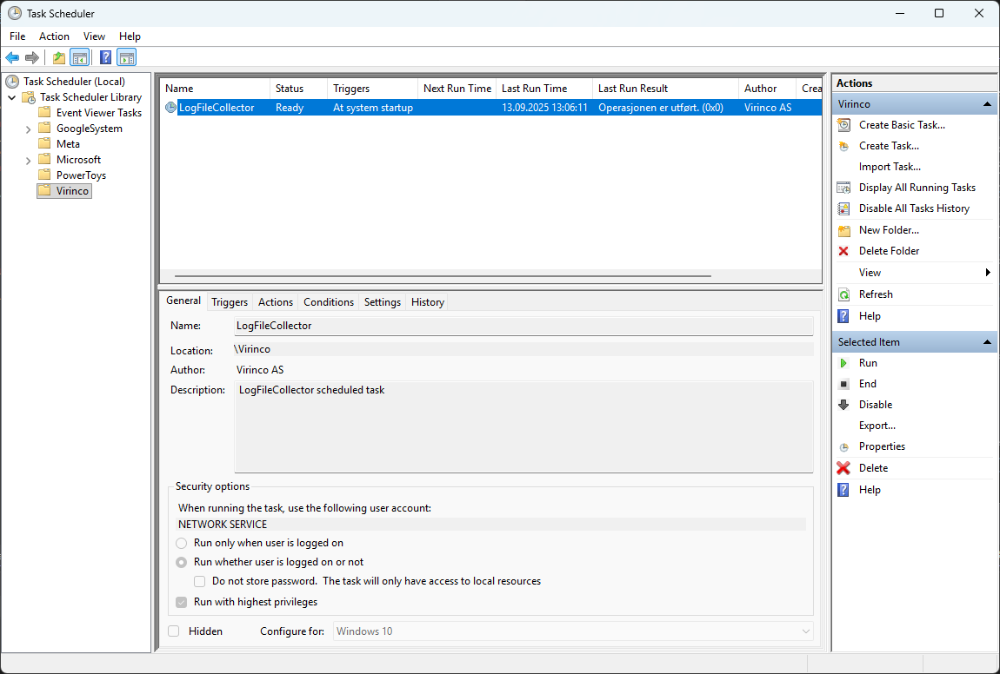

# LogFileCollector

**LogFileCollector** is a Windows console application built with **.NET Framework 4.8**.  
Author: *Ragnar Engnes for Virinco AS, 2025*  

---

## 🚀 Quick Start  

1. **Download**  
   Go to the [GitHub Releases](../../releases) page and download the ZIP archive:  
   ```
   LogFileCollectorSetup-x.x.zip
   ```  
   This archive contains:  
   - `LogFileCollectorSetup-x.x.exe` → installer  
   - `README.md` → this documentation  
   - `LICENCE.txt` → license terms  

2. **Extract**  
   Unzip the archive to a temporary folder.  

3. **Install**  
   Run the installer:  
   ```
   LogFileCollectorSetup-x.x.exe
   ```  

   > ⚠️ On first run, Windows SmartScreen may warn that the file is from an unknown publisher.  
   > Click **More info → Run anyway** to continue.  

4. **Configure**  
   After installation, edit the opened file:  
   ```
   C:\ProgramData\Virinco\WATS\LogFileCollector\appsettings.json
   ```  

5. **Run**  
   Either:  
   ```powershell
   LogFileCollector.exe --rescan
   ```  
   (one-time rescan + monitoring)  

   Or let the **scheduled task** (if enabled during install) run automatically at boot.  

---

## 📌 Background  
Virinco created this utility because installed custom converters in our **WATS Client** ([download.wats.com](https://download.wats.com)) do not support monitoring of subdirectories — they require a single folder to watch.  

To fill this gap, we built **LogFileCollector**, a lightweight companion utility.  
A more permanent integration is planned directly into WATS Client in the future.

---

## ⚙️ Overview  
LogFileCollector monitors a **source folder** for new files and copies them to a **target folder**.  

- Copied files are **tracked in a persistent SQLite database** to prevent duplicates — even after application restarts.  
- Supports file filters (e.g. `*.log`)  
- Optional **recursive subdirectory monitoring**  
- Fully configurable via `appsettings.json`  
- Designed to run automatically as a **Windows Scheduled Task** at boot  

---

## ✨ Key Features  

- 🔍 **Folder Monitoring**  
  Watches a folder (optionally including all subfolders) for new or updated files.  

- 🗄 **Persistent Tracking**  
  Prevents duplicate copies by recording file `(path, timestamp, size)` in an SQLite database.  

- 📝 **Flexible Configuration**  
  Customize source/target folders, file filter, rename strategy, logging, and more in a single JSON config.  

- 📑 **File Renaming Strategies**  
  Handles duplicate names in target folder:  
  - `counter` → `file_1.log`, `file_2.log`  
  - `timestamp` → `file_20250913_103500.log`  
  - `guid` → `file_a12b34c5.log`  

- 📊 **Logging**  
  Integrated with **Serilog**, configurable for log level, rolling files, retention, and message format.  

- 🔄 **Command-Line Options**  
  - `--rescan` → Perform a full scan of the source folder, copy all missing files, then continue watching.  
  - `--reset` → Clear the tracking database (`copied.db`).  

- ⚡ **Scheduled Task Support**  
  The installer can set up LogFileCollector as a Task Scheduler job (`\Virinco\LogFileCollector`) that runs at boot under `NetworkService`.  

---

## 🚀 Installation Details  

The installer (`LogFileCollectorSetup-x.x.exe`) is shipped **inside a ZIP file** for safe distribution.  
This avoids browser/antivirus false positives on direct `.exe` downloads.  

- Installs binaries into:  
  ```
  C:\Program Files\Virinco\LogFileCollector
  ```  

- Installs configuration into:  
  ```
  C:\ProgramData\Virinco\WATS\LogFileCollector\appsettings.json
  ```  

- Optionally creates a **Scheduled Task** in Task Scheduler for automatic startup.  

After installation, `appsettings.json` is opened in Notepad for editing.  

---

## 🔧 Configuration  

Example `appsettings.json`:  

```json
{
  "SourceFolder": "C:\\Logs\\Input",
  "TargetFolder": "C:\\ProgramData\\Virinco\\WATS\\OutputFolder",
  "Filter": "*.log",
  "IncludeSubdirectories": true,
  "FileCreatedDelayMs": 500,
  "DatabasePath": "copied.db",
  "RenameStrategy": "counter",
  "Logging": {
    "LogFilePath": "log.txt",
    "LogOutputTemplate": "[{Timestamp:HH:mm:ss} {Level:u3}] {Message:lj}{NewLine}{Exception}",
    "LogLevel": "Information",
    "RollingInterval": "Day",
    "RetainedFileCountLimit": 10,
    "Verbose": true
  }
}
```

---

## 📂 Usage  

Run manually from the console:

```powershell
LogFileCollector.exe [--rescan] [--reset]
```

- No arguments → continuous monitoring  
- `--rescan` → initial full scan, then monitoring  
- `--reset` → delete tracking database  

---

## 📝 License  

Copyright © 2025 **Virinco AS**  

Key points:  
- ✅ You may use and modify the software internally.  
- 🚫 Redistribution, resale, or sublicensing of modified versions is **not permitted**.  
- 🛠 Contributions (pull requests) are welcome, but acceptance is at Virinco’s discretion.  
- ⚠️ Software is provided **“AS IS”**, without warranty. Use at your own risk.  

See [LICENCE.txt](./LICENCE.txt) for the complete terms.  

---

## 📊 Workflow  

```
 ┌─────────────────┐
 │   SourceFolder  │   (local path or UNC share)
 └───────┬─────────┘
         │
         ▼
 ┌─────────────────┐
 │  File detected  │  ← FileSystemWatcher or Rescan
 └───────┬─────────┘
         │
         ▼
 ┌───────────────────────────────┐
 │  Check SQLite Database (DB)   │
 │  - FullPath                   │
 │  - LastWriteTimeUtc           │
 │  - Length                     │
 └───────┬─────────┬─────────────┘
         │ Yes     │ No
         │(exists) │(not exists)
         ▼         ▼
   ┌─────────┐   ┌────────────────────┐
   │  Skip   │   │  Copy to Target    │
   │ (already│   │  - Apply rename if │
   │ copied) │   │    needed          │
   └─────────┘   └─────────┬──────────┘
                           │
                           ▼
                  ┌───────────────────┐
                  │  Update Database  │
                  │   (mark copied)   │
                  └───────────────────┘
```

---

## 🖥 Scheduled Task Verification  

When you choose **“Create scheduled task”** during installation, the installer registers  
a Windows Task Scheduler entry:

- Folder: `\Virinco`  
- Task name: `LogFileCollector`  
- Runs as: `NetworkService`  
- Trigger: At system boot  
- Command:  
  ```
  "C:\Program Files\Virinco\LogFileCollector\LogFileCollector.exe" --rescan
  ```

You can verify the task in **Windows Task Scheduler**:  



*(Replace the image above with your own screenshot in `docs/scheduled-task.png`)*

---

## 📎 Appendix: Using Google Drive (or OneDrive/Dropbox) as Source Folder  

LogFileCollector can also work with **cloud storage folders** such as Google Drive, OneDrive, or Dropbox.  
There are some important considerations:  

### 🔹 Option A – Local Drive Letter (e.g. `G:\`)  
When you install **Google Drive for Desktop**, it mounts your drive as a virtual drive (often `G:\`).  
You can set this path in your `appsettings.json` like:  

```json
"SourceFolder": "G:\\My Drive\\Logs"
```  

⚠️ Limitation:  
- Drive letters (`G:\`) are tied to your interactive session.  
- If LogFileCollector runs as a **scheduled task under NetworkService or SYSTEM**, the drive letter may **not be available**.  

---

### 🔹 Option B – UNC Path (Recommended)  
Google Drive also exposes a UNC path, usually:  

```
\\GoogleDrive\My Drive\Logs
```

In `appsettings.json` (escape backslashes):  

```json
"SourceFolder": "\\\\GoogleDrive\\My Drive\\Logs"
```  

✅ Benefits:  
- Works in scheduled tasks (even under NetworkService).  
- More robust than using drive letters.  

---

### 🔹 Option C – Run Task as Your User  
If UNC paths are not available or not reliable in your environment, you can run the scheduled task as your **Windows user account**:  

- Open Task Scheduler → Properties → “Run as user” → select your account.  
- Enable “Run whether user is logged on or not”.  

This ensures the mapped Google Drive letter (`G:\`) is available.  

---

### 🔹 Notes for Other Cloud Drives  
- **OneDrive** → Use `C:\Users\\<username>\\OneDrive\\...` or UNC path if available.  
- **Dropbox** → Typically `C:\Users\\<username>\\Dropbox\\...`.  
- General rule: Prefer UNC/local paths over mapped drive letters.  

### 🔹 Permissions

LogFileCollector only needs read access to the source folder.
All duplicate detection and tracking is handled internally via the local SQLite database (copied.db).
Write permissions are only required for the target folder where files are copied.
